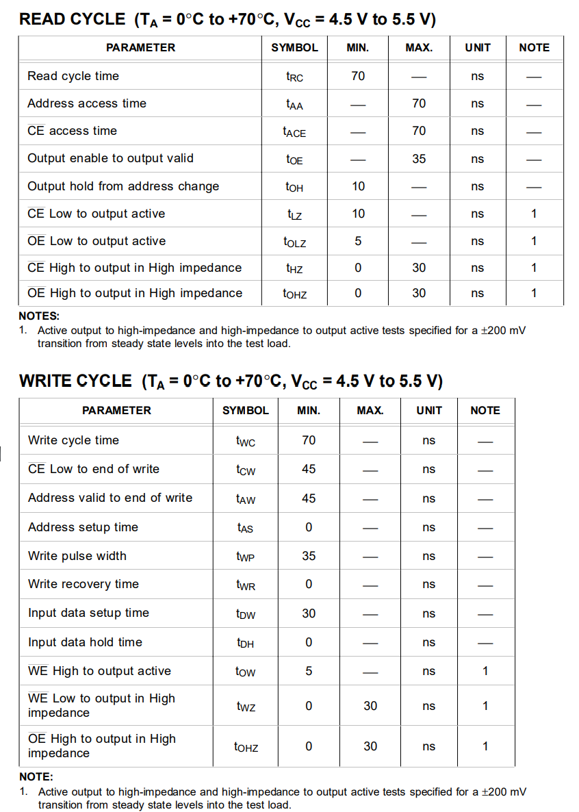

# Nintendo Controller Pak
An original OEM controller Pak, this one which is used for writing this document was included with Dōbutsu no Mori (Animal Forest). 

### Board
OEM pak utilizing a `32K X 8 CMOS STATIC RAM`, backed up by a battery to keep memory while
it is not inserted into a powered on system.

Unlike the OEM pack which uses a battery management IC, it utilizes a transistor, two diodes, and a couple resistors to manage the power.

#### Hardware Specs

    Ram chip: Sharp LH52256CN-10LL
    32K X 8 CMOS Static RAM

|||
|---|---|
|||

### Timings
Access times for read/write cycle is 70 ns

