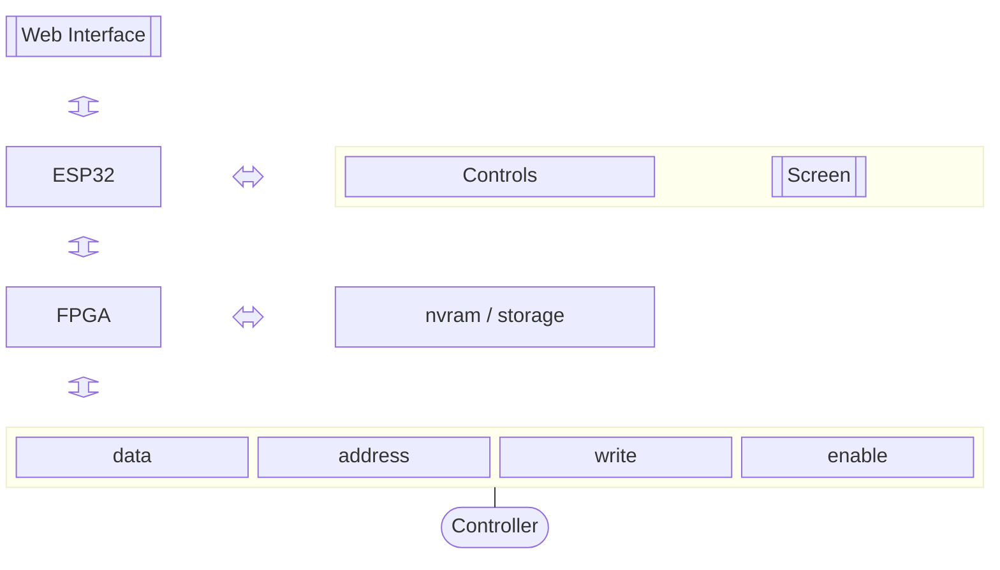

# N64 Super Controller Pak
Tired of having to keep multiple controller paks? Batteries running out and losing game saves? Developer wanting to test on PC and on physical hardware?

_The N64 Super Controller Pak is the solution you've been waiting for!_

## Overview
This is a fully custom controller pak for the Nintendo 64 console, designed to fit in place of the aging controller paks that you may have been using. There are many options for Non-Volitile upgrades, or modifications to original hardware, but this is a project to bring it into current tech, and add many quality of life features.

___Work in Progress, no designs are finalizied, this is a living project and is being rapidly iterated upon___

### Features
- Large number of Virtual Paks of data in one device
- Customizable display of which Virtual Pak is selected
- Easy selection of Virtual Pak
- Web interface for management via bluetooth/wifi

### Challenges
- Hardware design
    - ESP32 module is easy for general connection for web and screen control, but lacks IO for
    - Circuity to bring the 15 bit address, and 8 bit databus, into a manageble system from the esp32
    - Relatively unknown timings / challenges moving data around at speed
- Cost
    - Fancy hardware has a price tag to match
    - Solutions may use easier to work with hardware over complexity of design and cost
- Software
    - May require interfacing/programming hardware

## Design

Primary Blocks:
- ESP32 : Handles the Web interface, and Hardware interface
- FPGA ? : The heart of the memory management, reads/writes to the storage, this seems like an overkill solution, but also the simplest to design around
- Bus : The connection to the controller

