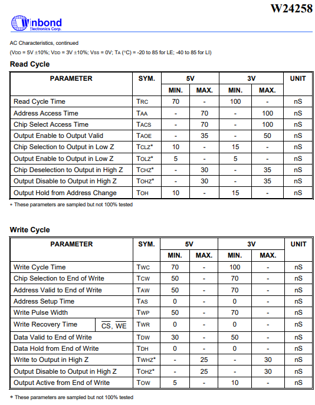

# Preformance Memory Card

Commonly found 3rd party memory card, longer than the OEM controller pak

{ width=290 }{border-effect=line}

### Board
Similar to the OEM pack, utilizes a `32K X 8 CMOS STATIC RAM`, backed up by a battery to keep memory while
it is not inserted into a powered on system. 

Unlike the OEM pack which uses a battery management IC, it utilizes a transistor, two diodes, and a couple resistors to manage the power.

#### Hardware Specs

    Ram chip: Winbond W24258-70LE 
    32K X 8 CMOS Static RAM

| { width=400 } | { width=400} |
|--------------------------------------------------------------------------------------------|-----------------------------------------------------------------------------------------|

### Timings
THe write address access time, and write cycle time is longer than the OEM pak at 100nS

