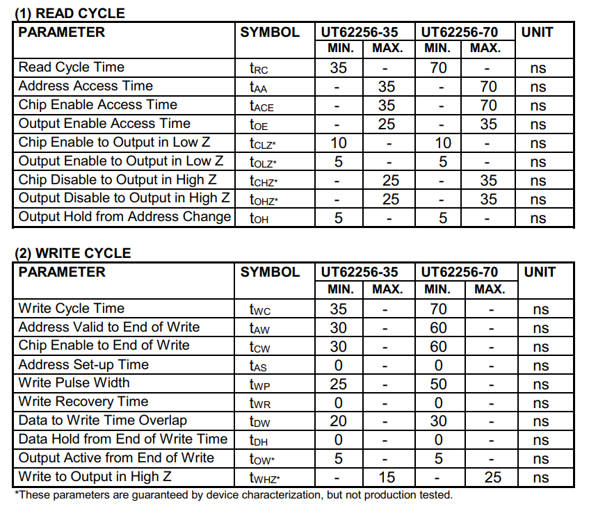

# Mad Catz / High Frequency
Similar to the OEM pak form factor and case wise, primary differences:
* Grip Area is not inset, instead having a line pattern to grip
* Uses phillips head screws
* No discernible injection mold markings

This took some research to find, these were made in Hong Kong by Mad Catz, but were also sold branded as "High Frequency"
through Toys'R'Us. There were other versions available in a x4 and x16 versions which include an LCD screen to select between "pages"

### Board
OEM pak utilizing a `32K X 8 CMOS STATIC RAM`, backed up by a battery to keep memory while
it is not inserted into a powered on system.

Similar to the performance memory card, it utilizes a transistor and some other circuity to keep power to the ram chip.

#### Hardware Specs

    Ram chip: UTRON UT62256SC-35L
    32K X 8 Bit Low Power CMOS SRam

|  |  |
|--------------------------------------------------------------------------|------------------------------------------------------------------------|
|  |  |

### Timings
This is an upgrade over the other options, being the "-35" model, timings are at 35ns for most operations compared to 70ns.  

